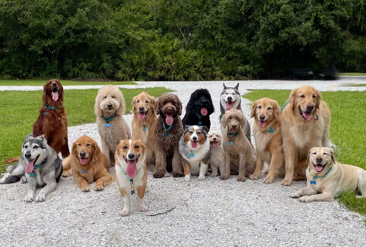

## Hi there 👋

**Ginny980/Ginny980** is a ✨ _special_ ✨ repository because its `README.md` (this file) appears on your GitHub profile.

Here are some ideas to get you started:

- 🔭 I’m currently working on getting myself familiar with GitHub I am a High School Dual Credit Business and CS Instructor, trying to learn something new to share wth my students...
- 🌱 I’m currently learning the Basics.and trying my hand at something new..
- 👯 I’m looking to collaborate on GitHub...
- 🤔 I’m looking for help with ...
- 💬 Ask me about Business...
- 📫 How to reach me: edalvares@cps.edu...
- 😄 Pronouns: She/her...
- ⚡ Fun fact: I love Creative Art...

